# NBA Draft Prediction

`Kadir Ersoy`

## Predicting the possible win shares of a player if he were drafted to NBA

- Win-shares and Vorp(Value-over-replacement) are two of the most preeminent success
stats for NBA
- Win Shares is a player statistic which attempts to divvy up credit for team success to
the individuals on the team.
- Before doing any regression, I would like to see plot of WS for all players.
- So I would like to plot each draft player vs Winshare plot
    - For 2009-2022

## First Trials

### **True values**

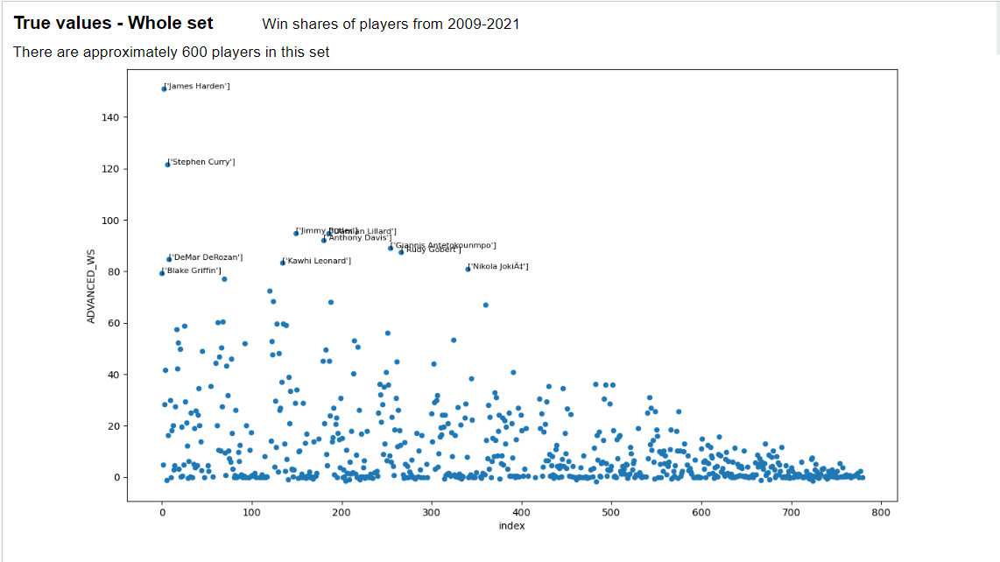

### Remarks

I have used 7 columns while training this data set (Dataset has 65
columns) 

- Mainly because I didn’t have time to do feature selection
- I researched for most effective stats for success on NBA

**Columns:**

- Games Played,
- Minutes percentage in-game,
- Offensive Rating,
- Usage,
- Effective Field Goal,
- True-Shooting percentage,
- Defensive Rating

### **Training**

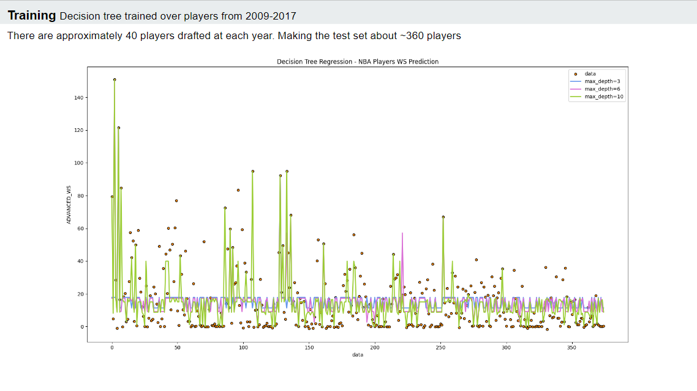

### Testing:

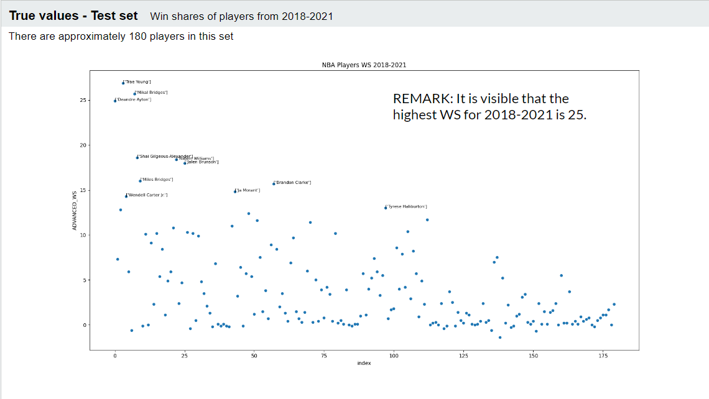

### TEST Results:

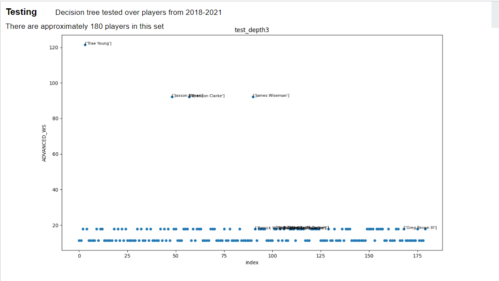
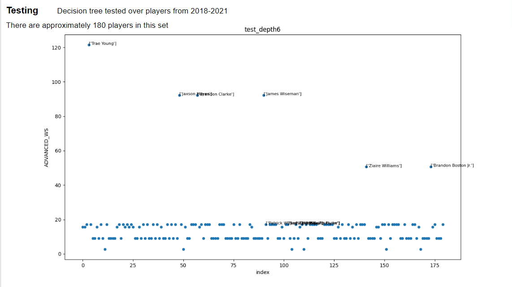
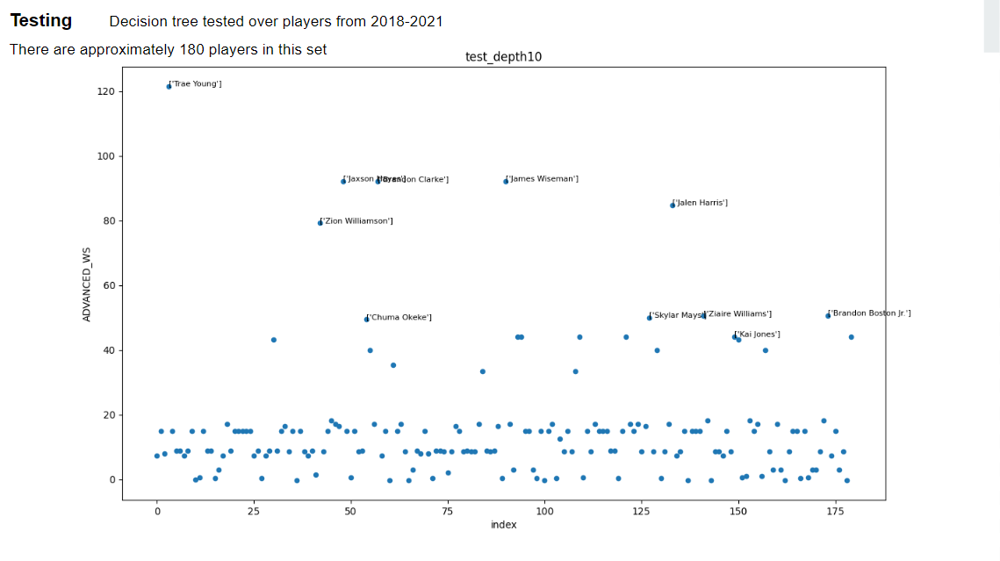

### All combined:

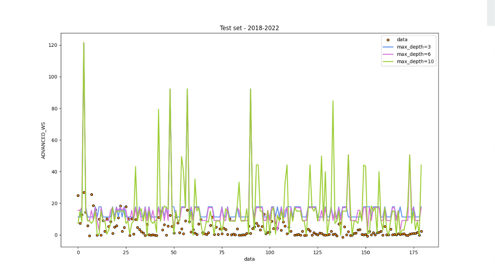

### Problems with initial results

- Number of test samples
- Current data being very close to the present-day
    - WS prediction of a player who has not finished his career is a little problematic.
    - Reason is True values of WS for 2018-2021 players are actually not complete since
    the players have games to play and
        - Usually a player in NBA gets to his most effective years after playing for 4-
        years, and maintains that high performance for another ~5 years.
        - So true values for 2018-2022 is less than the player’s expected success
    - I suppose I should use data from 80s-90s for training, and test it on 2000s or
    2010s, Since most of 2010 players have reached their potential.
    

### Future Objectives

I would like to increase my data size, reaching to 80s and having a better approximation.

I will do a proper feature selection.

## Main Trial

### **Parameter Tuning**

I have used Grid Search and exhaustively tried couple of options, aiming to find the best combination for the hyperparameters.

**Decision Trees:**

For Decision Trees, the hyper parameters were depth, minimum samples to split and minimum samples on a leaf node.

**Random Forests:**

Since it uses decision trees, same hyper parameters again used. But also, since Random Forests uses ensemble of Trees to make decisions, we have number of trees as another hyperparameter.

### Model Training Results

**Random Forests**

I have utilized Random Forests to do regression, rather than decision trees that were used last time, on predicting the possible win shares a drafted college player can achieve on NBA.

I have learned that Random forests use ensemble of Decision trees and return the average of their prediction for regression. So I expect to see better results than single Decision Tree.

**Results - Decision Trees**

My vanilla results from Decision trees mostly were poor. So, I tried parameter tuning, feature selection and even standard scaling the features.

However, R2 score of the test, which is a goodness of fit indicator, did not improved. For RMSE, on a scale of 0-200 target value, I acquired ~40. My final thoughts is that the data set features had pretty much even distribution, which prevents me from making a valuable prediction. To solidify that idea, I have done pair plotting of features with my target.

Also the number of samples is around 1300, which might be another reason of failure.

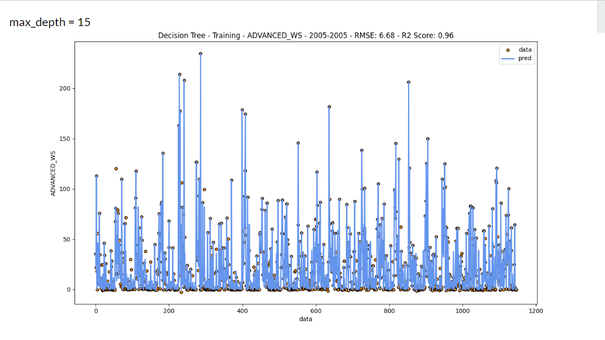
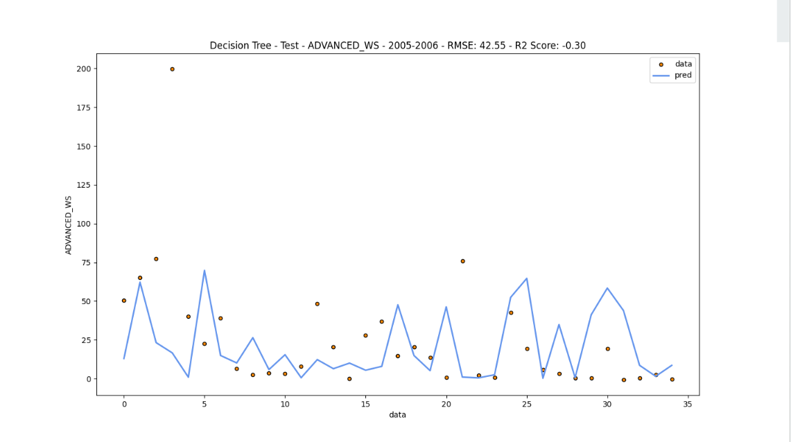
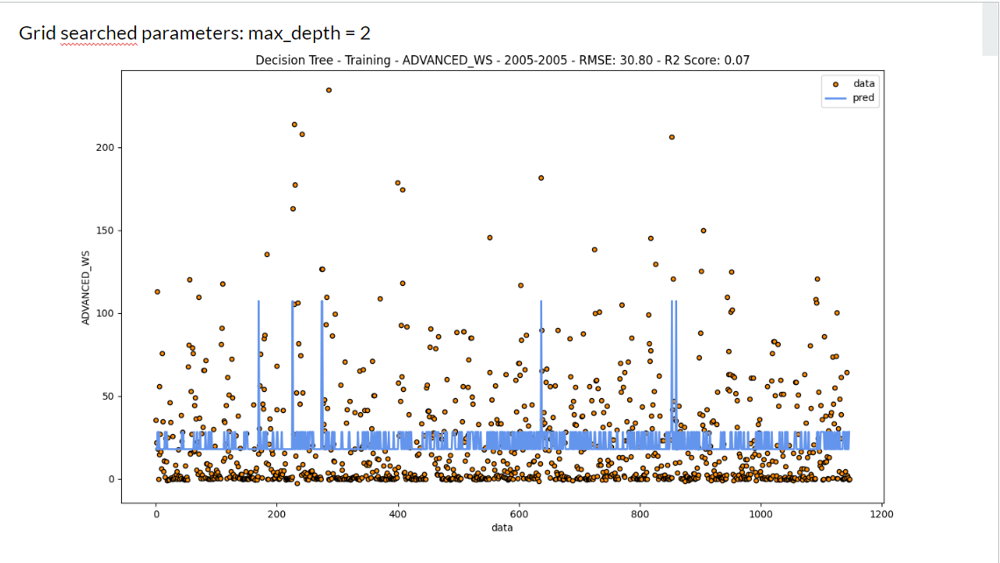
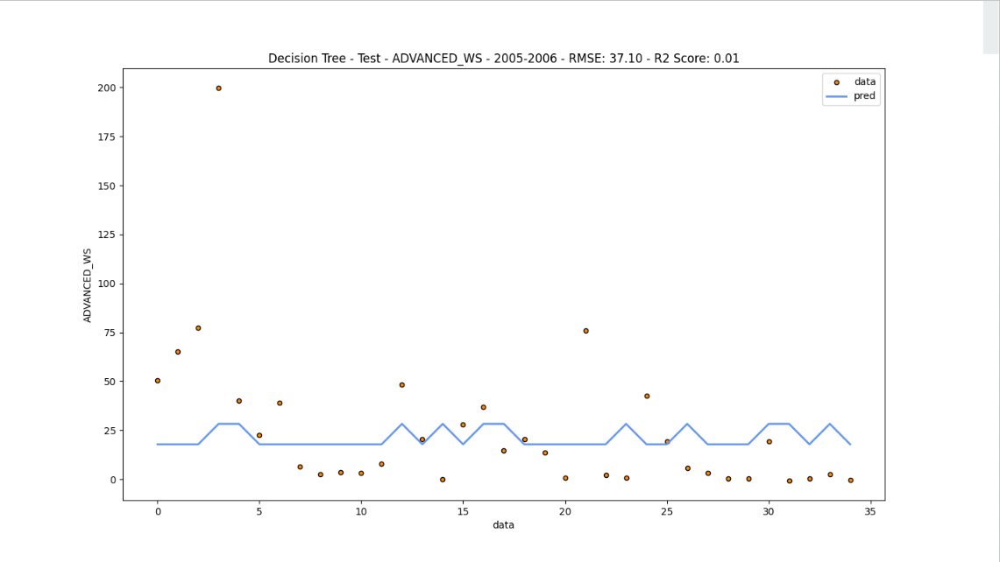

### **Feature Selection**

I have researched and found that good features should be highly correlated with the target and uncorrelated among themselves. Also knowing from the class that high variance on features might mean more information carried on it.

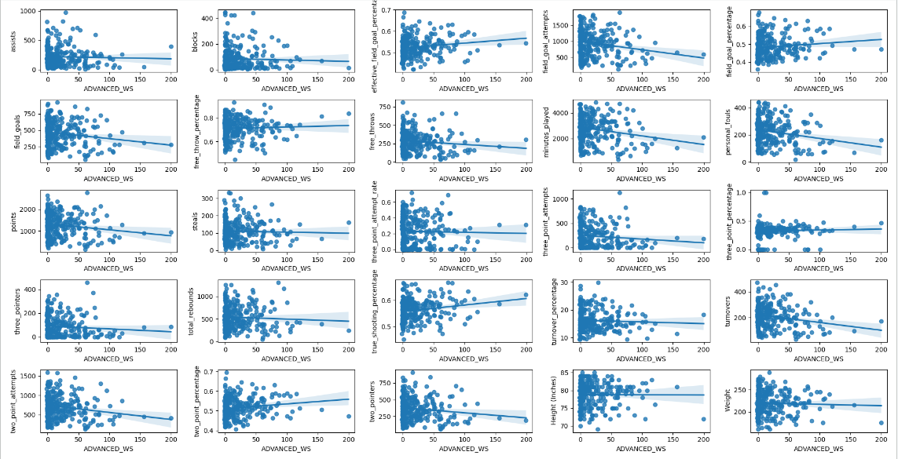

**Results - Random Forests**

Similar problems with Decision Trees persist with Random Forests as well. It is not very surprising since the inner mechanism of both are the same. Random forests have slightly better results but the improvement is not huge.

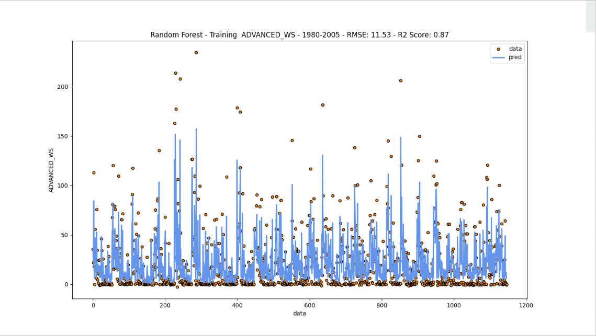
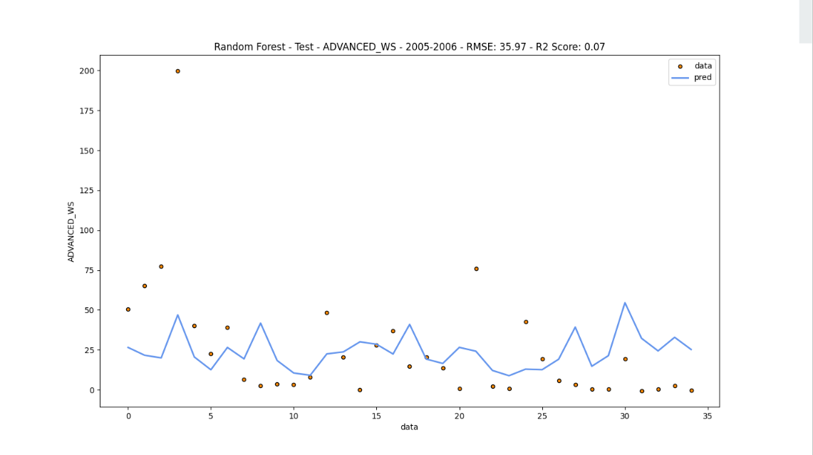
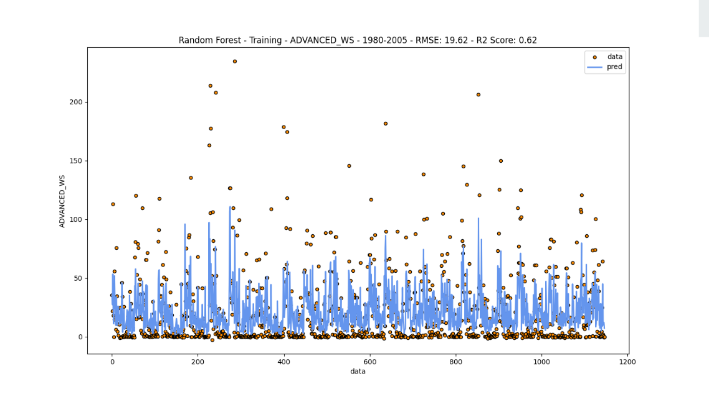
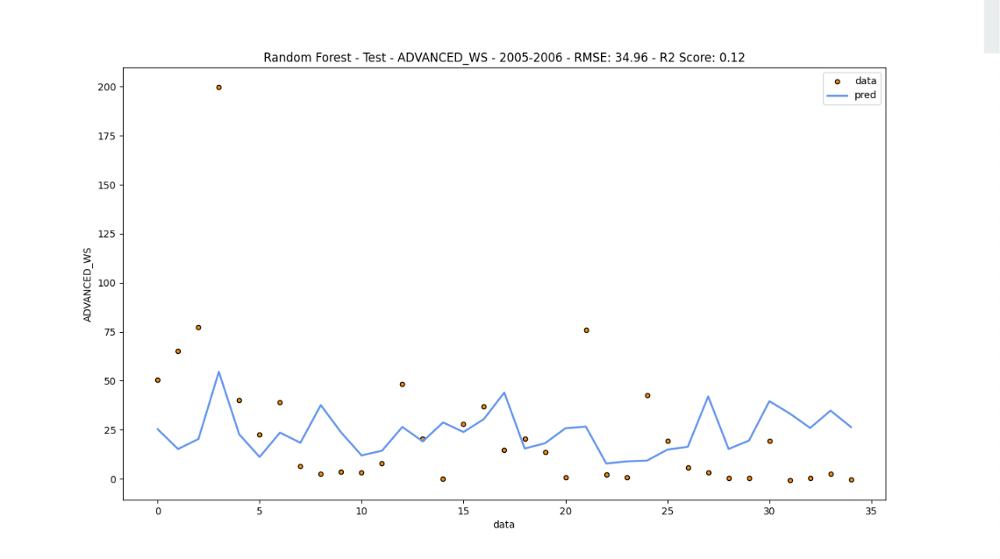

**Final Thoughts**

To be precise, I was not very careful examining the dataset and realizing the limitations and kept trying on finding a way to improve accuracy via modifying the parameters and dataset etc. Other than that, I can say that I have learned most of the subjects that I have worked on even though I could not acquire successful results.